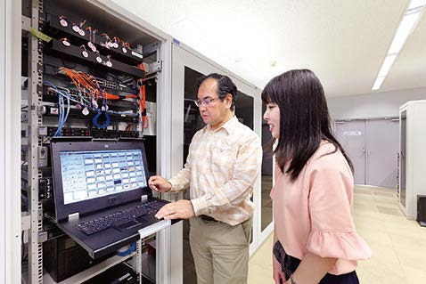
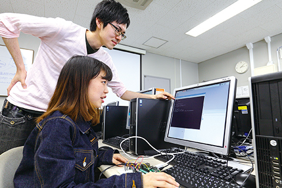

# 情報工学科の紹介
#３つのコースに分かれている!
1. *システムエンジニアリングコース*
* プログラミングによって時代の求める新しい情報システムを作る

2. *インターネット＆セキュリティコース*
* 安全で安心できる持続的な情報社会を支えるネットワークとセキュリティを学ぶ

3. *知能情報コース*
* 「モノ」と「コト」の未来へAIの先を拓く

学科データ

||人数|
|---|---|
|学生|341名|
|留学生|14名|

コースについてはこちらのサイトから:+1:↓
https://feng.takushoku-u.ac.jp/course/cs/introduction.html
- [ ] 2種類以上の見出し(headers)を使っている．
- [ ] 2種類以上の強調(emphasis)を使っている．
- [ ] (番号付きの)リスト(ordered lists)を使っている
- [ ] (番号無しの)リスト(unordered lists)を使っている．
- [ ] 1つ以上の画像(images)を使っている．
- [ ] 1つ以上のリンク(links)を使っている．
- [ ] 1つ以上の表(tables)を使っている．
- [ ] 1つ以上の絵文字を使っている．
